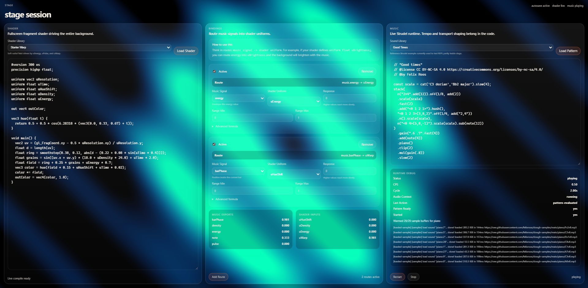

# stage

stage is a browser-based live-coding environment that combines shader performance and music performance in a single workstation. The app is inspired by ShaderToy and Strudel, but the actual product is the link between them: a central binding layer that lets exported values from the music runtime drive the shader runtime, and eventually allows controlled feedback in the other direction.

The interface is built around three transparent panels over a fullscreen shader canvas:

- left panel: shader editor
- center panel: bindings editor and shared state inspector
- right panel: music editor

The shader is the real background. Text, editor chrome, cursors, panels, and controls are rendered separately above the canvas so the visuals remain visible through the entire interface without distorting legibility.

## Project Goal

The goal of stage is to feel less like "two editors side by side" and more like a playable audiovisual instrument. The important idea is that shader code and music code are independent runtimes with a clearly defined contract between them.

The product should make it easy to:

- write fullscreen fragment shaders
- write pattern-based music code
- export named values from the music side
- route those values into shader uniforms through a middle patchbay
- save and reopen sessions locally
- iterate quickly in the browser without requiring a backend

stage is not trying to be a full clone of ShaderToy or Strudel in v1. It is a composable browser instrument that borrows the best interaction patterns from both while introducing a stronger shared-state model.

## Core Product Shape

The app has four conceptual pieces:

- shader runtime
- music runtime
- bindings runtime
- UI shell

For v1, the primary flow is one-way:

`music exports -> bindings -> shader uniforms`

This is intentional. Two-way feedback between shader analysis and music scheduling is interesting, but it adds timing, stability, and debugging complexity too early. The first version should prove the patchbay concept with deterministic one-way routing.

## User Experience

The intended user experience is:

1. The user opens the app and immediately sees a fullscreen shader output.
2. The user edits shader code in the left panel.
3. The user edits music code in the right panel.
4. The user uses the center panel to map exported music values into shader inputs.
5. The app updates visuals and sound live with minimal friction.
6. The current session is autosaved locally and can be restored after the browser is closed.

The center panel is not a generic notes area. It is the actual patchbay and should expose:

- current exported values
- available shader inputs
- active bindings
- transforms like smoothing, clamping, and scaling
- live inspection of resolved values

## Technology Decisions

The current recommended stack is:

- `Vite` for build and development
- `React` for the UI shell
- `TypeScript` for type safety across runtimes and saved session formats
- `CodeMirror 6` for embedded editors
- `WebGL2` for shader rendering
- `twgl.js` as a lightweight WebGL helper
- `Strudel` for music coding and scheduling
- `Zustand` for UI and session-level state
- `expr-eval` or `jsep` for parsed binding expressions
- `zod` for session validation and migrations
- `idb` for IndexedDB access

## Why This Stack

### Vite

This app is a browser workstation, not a content site. It benefits more from fast local iteration and a clean static deployment target than from SSR or server-heavy routing.

### React

React should own layout, panel composition, inspectors, dialogs, and app state wiring. It should not own the realtime render loop of the shader canvas.

### TypeScript

stage depends on a stable shared contract between panels. TypeScript is necessary to keep the session schema, exports, bindings, and runtime store coherent as the app grows.

### WebGL2

A ShaderToy-style fullscreen fragment pipeline maps naturally to raw WebGL2. A larger abstraction such as Three.js would be unnecessary for v1.

### Strudel

If the project wants to inherit real live-coding affordances from the browser music ecosystem, Strudel is the strongest starting point.

### IndexedDB

Sessions will contain code, bindings, metadata, and drafts. Cookies are too small and are the wrong storage layer. IndexedDB is the correct persistence model for this kind of local creative tool.

## Deployment Assumptions

The app is expected to be deployed on Vercel.

That has a direct architectural consequence: the hot path must stay in the browser.

The following should be fully client-side in v1:

- shader compilation and rendering
- music scheduling and playback
- binding evaluation
- session autosave and restore
- local preset management

Vercel is used primarily to:

- host the static SPA
- serve assets
- optionally expose lightweight APIs later for publishing or sharing saved sessions

Vercel Functions should not sit in the render loop, audio loop, or binding loop. If real-time collaboration or pub/sub is added later, it should use a dedicated realtime provider rather than trying to force that responsibility into serverless function execution.

## Runtime Architecture

The runtime should be split into explicit modules with narrow responsibilities.

### 1. UI Shell

The UI shell is the React application layer. It owns:

- overall viewport layout
- panel resizing and focus state
- toolbar and transport controls
- session management UI
- inspectors and debugging panels
- editor containers

It should not perform shader rendering or audio scheduling directly.

### 2. Shader Engine

The shader engine is a dedicated fullscreen canvas runtime behind the UI. It owns:

- WebGL context creation
- fragment shader compilation
- animation frame loop
- resolution and time uniforms
- receiving resolved shared inputs from the binding engine
- drawing the current frame

For v1, the shader engine should consume a compact, typed `shader.inputs` object every frame.

It should not know anything about music code or binding syntax. It only receives resolved values.

### 3. Music Engine

The music engine owns:

- music code evaluation
- clock and transport state
- Web Audio scheduling
- exposing named values into `music.exports`

Examples of exported values:

- `tempo`
- `step`
- `bar`
- `barPhase`
- `energy`
- `density`
- `note`

The music engine should not know about WebGL uniforms directly. It exports values into the shared store and lets the bindings runtime decide how they are routed.

### 4. Binding Engine

The binding engine is the defining subsystem of the project. It owns:

- parsing binding expressions
- validating source and target names
- reading from the shared store
- applying transforms
- writing resolved values to shader inputs
- exposing debugging information for the inspector

Example bindings:

```txt
uGlow = smooth(music.energy, 0.8) * 1.2
uWarp = music.barPhase
uNoise = clamp(music.density * 0.5, 0.0, 1.0)
```

This engine should compile expressions once and evaluate them against current runtime values on each relevant update.

### 5. Persistence Layer

The persistence layer owns:

- saved sessions
- autosaved drafts
- recent session references
- restoring state on load
- future import/export flows

The persistence layer should only save user-authored state and configuration. It should not try to serialize runtime internals like WebGL program objects, audio nodes, or compiled ASTs.

## Dataflow

The dataflow for v1 should be deterministic and simple:

1. Music engine updates transport and exported values on its own musical clock.
2. Binding engine evaluates affected bindings using the latest exports.
3. Binding engine writes resolved values into `shader.inputs`.
4. Shader engine reads the latest `shader.inputs` snapshot on each animation frame.
5. UI shell reflects source code, transport state, and current resolved values.

The initial supported direction is:

`music.exports -> bindings -> shader.inputs`

Potential future direction:

`shader.analysis -> bindings -> music.inputs`

That future mode should remain deferred until the one-way path is stable and inspectable.

## Timing Model

Timing must be explicit because the app combines frame-based graphics and clock-based audio.

### Shader Timing

- driven by `requestAnimationFrame`
- redraws every visible frame
- consumes the latest resolved shader inputs

### Music Timing

- driven by the transport clock
- updates on musical subdivisions rather than animation frames
- exports values that are meaningful at musical time

### Binding Timing

Bindings can evaluate on two triggers:

- on each music tick for transport-driven values
- optionally on each frame for smoothed or interpolated values

The result should always be a resolved `shader.inputs` snapshot that is cheap for the shader engine to consume.

## Shared State Model

The app needs a typed shared runtime store that exists independently of React rendering frequency.

Suggested top-level runtime namespaces:

- `music.exports`
- `shader.inputs`
- `shader.exports` later
- `transport`
- `bindings.runtime`
- `ui.session`

React state should not be the source of truth for per-frame or per-tick signal flow. The realtime engines should operate on a dedicated store or service layer, with React subscribing only where necessary for display.

## Session Schema

The main persisted artifact is a session.

```ts
type Session = {
  id: string
  name: string
  version: 1
  createdAt: string
  updatedAt: string

  shader: {
    source: string
    entry: "mainImage"
    uniforms: Record<string, UniformDefinition>
  }

  music: {
    source: string
    engine: "strudel"
    exports: Record<string, ExportDefinition>
  }

  bindings: Binding[]
  transport: TransportState
  ui: UIState
  metadata?: {
    description?: string
    tags?: string[]
  }
}

type UniformDefinition = {
  type: "float" | "vec2" | "vec3" | "vec4" | "int" | "bool"
  defaultValue: number | boolean | number[]
}

type ExportDefinition = {
  type: "number" | "boolean" | "string"
  description?: string
}

type Binding = {
  id: string
  enabled: boolean
  sourceScope: "music" | "shader"
  sourceKey: string
  targetScope: "shader"
  targetKey: string
  expression: string
  smoothing?: number
  clamp?: { min: number; max: number }
}

type TransportState = {
  bpm: number
  playing: boolean
}

type UIState = {
  layout: {
    leftWidth: number
    centerWidth: number
    rightWidth: number
  }
  activePanel: "shader" | "bindings" | "music"
  inspectorOpen: boolean
}
```

This schema keeps source code, patch routing, transport state, and UI state separate. That separation matters for future features like duplication, export/import, presets, and schema migration.

## Local Persistence

stage should support reopening work after the browser is closed without requiring accounts or a backend.

### Use IndexedDB, Not Cookies

Cookies are not appropriate for this app because they are:

- too small
- sent with requests
- inconvenient for structured creative session data

Instead:

- use `IndexedDB` for sessions, drafts, and presets
- use `localStorage` only for tiny preferences and the last-opened session pointer

### Recommended Stores

IndexedDB database name:

- `stage`

Object stores:

- `sessions`
- `drafts`
- `presets`

Useful indexes:

- `updatedAt`
- `name`

### Restore Behavior

On startup:

1. Read `lastOpenedSessionId` from `localStorage`.
2. Check whether a draft exists for that session.
3. If a draft exists, restore the draft.
4. Otherwise load the saved session.
5. If nothing exists, create a default starter session.

### Autosave Behavior

Recommended behavior:

- mark the current session dirty on edit
- debounce autosave every 2 to 5 seconds
- write draft state to IndexedDB
- update `updatedAt`
- keep explicit save operations for named sessions

### Persisted vs Non-Persisted State

Persist:

- shader source
- music source
- bindings
- transport defaults
- UI layout preferences
- metadata

Do not persist:

- WebGL program instances
- audio nodes
- transient frame values
- compiled expression ASTs
- other rebuildable runtime internals

## Visual Design Direction

The interface should feel like a translucent instrument panel over a living visual field.

Key visual rules:

- fullscreen shader canvas behind everything
- transparent editor panels
- text rendered in a normal overlay layer for clarity
- minimal glass or tint only where focus and interaction need support
- no opaque code editor blocks that kill the background effect

The shader should remain visually present across the entire viewport, including behind panel regions.

## Current Runtime Blocker

The main unresolved issue right now is Strudel playback parity.

There is a reproducible case where a Strudel example that plays correctly on `strudel.cc` does not behave the same way inside `stage`. The specific symptom the user is experiencing is:

- a long delay before playback starts
- a similarly long delay before each loop repeats
- the phrase does not evolve between repeats the way it does in the official Strudel REPL

The main reference example is this `Good times` snippet by Felix Roos:

```js
// "Good times"
// @license CC BY-NC-SA 4.0 https://creativecommons.org/licenses/by-nc-sa/4.0/
// @by Felix Roos

const scale = cat('C3 dorian','Bb2 major').slow(4);
stack(
  n("2*4".add(12)).off(1/8, add(2))
  .scale(scale)
  .fast(2)
  .add("<0 1 2 1>").hush(),
  "<0 1 2 3>(3,8,2)".off(1/4, add("2,4"))
  .n().scale(scale),
  n("<0 4>(5,8,-1)").scale(scale).sub(note(12))
)
  .gain(".6 .7".fast(4))
  .add(note(4))
  .piano()
  .clip(2)
  .mul(gain(.8))
  .slow(2)
  .pianoroll()
```

What has already been ruled out:

- the pattern itself is not sparse: direct `queryArc(...)` inspection shows dense onsets across consecutive cycles
- sample fetch time is not the whole explanation: `piano` sample buffers load quickly and the long repeat gap still remains
- the issue does not go away by reducing export polling, disabling music binding analysis, or reducing shader-side work

Current conclusion:

- the bug is in the browser runtime integration layer, not in the user’s Strudel code
- `stage` still does not yet match the behavior of the official Strudel REPL closely enough for this example
- achieving true Strudel parity is now a primary engineering goal for the music side

This matters because `stage` is not meant to be merely “Strudel-inspired.” The intended goal is:

- anything that works in Strudel should work in `stage`
- `stage` should then add shader control, bindings, session persistence, and the central patchbay on top of that base

## MVP Scope

The MVP should be intentionally narrow.

### In Scope

- fullscreen shader rendering
- three-panel transparent layout
- editable shader source
- editable music source
- center patchbay with named bindings
- live value inspector
- local autosave and restore
- recent sessions list

### Out of Scope for v1

- real-time collaboration
- account system
- cloud sync
- shader-to-music feedback routing
- full preset marketplace
- desktop packaging

## Suggested Folder Architecture

One reasonable initial structure:

```txt
src/
  app/
    App.tsx
    layout/
    routes/
  components/
    panels/
    inspectors/
    controls/
  features/
    shader/
      engine/
      compiler/
      store/
    music/
      engine/
      transport/
      store/
    bindings/
      parser/
      runtime/
      store/
    sessions/
      persistence/
      migrations/
      templates/
  lib/
    state/
    types/
    utils/
  styles/
```

Suggested responsibility split:

- `features/shader`: WebGL runtime, shader compile pipeline, uniform application
- `features/music`: Strudel integration, transport clock, export publishing
- `features/bindings`: expression parsing, binding evaluation, validation, runtime inspection
- `features/sessions`: session schema, IndexedDB persistence, autosave, restore, migrations

## Engineering Principles

The implementation should follow these principles:

- keep the hot path client-side
- keep runtime boundaries explicit
- treat sessions as first-class artifacts
- keep dataflow inspectable
- prefer deterministic one-way routing in v1
- separate UI state from realtime signal state
- avoid overbuilding server infrastructure before it is needed

## Future Expansion

After v1 is stable, the most natural next steps are:

- shader analysis exports
- controlled shader-to-music routing
- import and export of session JSON
- shared patch URLs
- cloud-published presets backed by a lightweight API
- collaboration via an external realtime provider

Each of those depends on the core patchbay model being solid first.

## Development Priorities

A sensible implementation order is:

1. scaffold the Vite + React + TypeScript app
2. establish fullscreen canvas + transparent panel layout
3. integrate CodeMirror editors
4. build the shader engine
5. integrate the music engine
6. implement the binding parser and runtime
7. add session schema validation and local persistence
8. add inspector and debugging views

## Summary

stage is a live audiovisual coding instrument for the browser. Its novelty is not just that it combines shader code and music code, but that it introduces a clear, editable patching layer between them.

If the implementation stays disciplined about boundaries, timing, and session persistence, the first version can be both deployable on Vercel and strong enough to grow into a much more ambitious system later.
